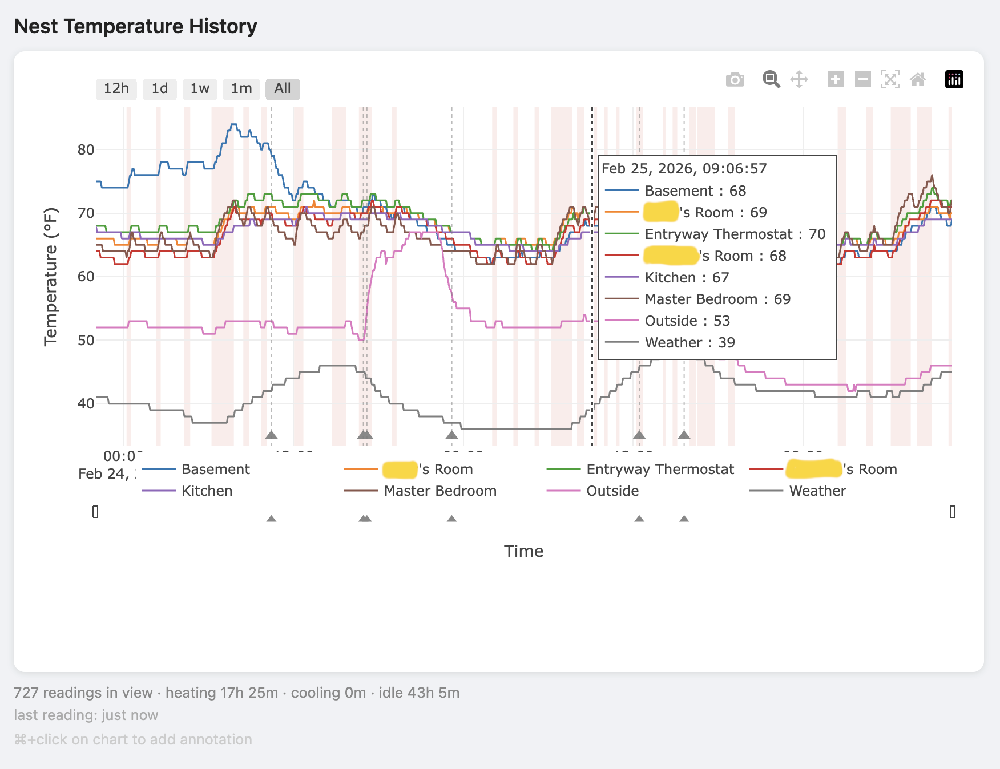

# nest-logger

Log historical temperature readings from all Nest room sensors and graph them
over time.  Each sensor appears as its own line on a time-series chart, with
thermostat HVAC state (heating / cooling / idle) shown as background shading.
Annotate your data directly in the chart.



## How it works

A Chrome extension scrapes the [home.nest.com](https://home.nest.com) web app
every 5 minutes and POSTs the readings to a small Express server running on
your local machine.  The server stores everything in a SQLite database and
serves an interactive Plotly.js chart.

```
home.nest.com tab
  └─ Chrome extension (scraper.js + background.js)
       └─ POST /api/readings
            └─ Express server (server.js)
                 ├─ SQLite database (nest.db)
                 └─ Plotly.js chart (localhost:51920)
```

## Requirements

- [Node.js](https://nodejs.org) 18+ (or use [nvm](https://github.com/nvm-sh/nvm))
- Google Chrome
- A Nest account with at least one thermostat, accessible at home.nest.com
- Linux with systemd (for the optional always-on service)

## Setup

### 1. Clone the repo

```bash
git clone https://github.com/joeyparrish/nest-logger.git
cd nest-logger
```

### 2. Start the server

```bash
cd server
npm install
npm start
```

The server listens on port 51920.  Open http://localhost:51920 to see the
chart (it will be empty until the extension sends its first reading).

### 3. Load the Chrome extension

1. Open `chrome://extensions` in Chrome.
2. Enable **Developer mode** (toggle in the top-right corner).
3. Click **Load unpacked** and select the `extension/` folder from this repo.

Once loaded, navigate to [home.nest.com](https://home.nest.com) in a tab and
log in.  The extension will automatically navigate to your thermostat page and
begin scraping every 5 minutes.  You should see readings appear in the chart
within a few minutes.

> **Note:** The tab must remain open for data to be collected.  The server
> runs independently and does not need the tab to serve the chart.

## Running the server at boot (Linux + systemd)

To keep the server running in the background without leaving a terminal open,
install it as a systemd user service.  This also starts it automatically at
boot without requiring a login.

```bash
cp server/nest-logger.service ~/.config/systemd/user/
```

Edit `~/.config/systemd/user/nest-logger.service` and update the `ExecStart`
line to the absolute path of `start.sh` in your clone:

```ini
ExecStart=/bin/bash /path/to/nest-logger/server/start.sh
```

Then enable and start the service:

```bash
loginctl enable-linger $USER   # allow user services to run without login (once)
systemctl --user daemon-reload
systemctl --user enable --now nest-logger
```

Useful commands:

```bash
systemctl --user status nest-logger
journalctl --user -u nest-logger -f   # live logs
systemctl --user restart nest-logger
systemctl --user stop nest-logger
```

> **nvm users:** `start.sh` automatically loads nvm and uses whatever Node
> version is set as your default.  No need to hard-code a version.

## Chart features

- **Temperature lines** — one per sensor, rendered with WebGL for smooth
  panning and zooming over large date ranges.
- **HVAC shading** — semi-transparent red/blue background bands show when the
  system was heating or cooling.
- **Range selector buttons** — quickly jump to the last 12 hours, 1 day,
  1 week, 1 month, or the full history.
- **Range slider** — drag the handles below the timeline to pan and zoom.
- **Status bar** — shows the number of readings in view and time spent
  heating, cooling, and idle for the visible range.
- **Last reading indicator** — shows how long ago the most recent data point
  was collected, updated every minute.
- **Auto-refresh** — the chart fetches new data automatically, timed to arrive
  shortly after each new reading is expected from the extension.
- **Annotations** — Ctrl+click (or ⌘+click on Mac) on any data point opens
  an annotation form pre-filled with the clicked timestamp.  Annotations appear
  as dotted vertical lines with triangle markers; hovering shows the note text.

## Development

To populate the database with synthetic data for testing without the
extension:

```bash
cd server
node seed.js
```

This generates 3 days of 5-minute readings with a sinusoidal temperature
curve and simulated HVAC cycles, inserted with `INSERT OR IGNORE` so it is
safe to run against a database that already contains real data (seed
timestamps are set to one year before the tool was created).

## Data

The SQLite database is stored at `server/nest.db` and is created
automatically on first run.  It is not checked into the repository.  Back it
up if you want to preserve your history.

```sql
sensor_readings (timestamp, section, sensor, value)
hvac_states     (timestamp, action)
```

All timestamps are UTC ISO 8601 strings.  The chart converts them to the
browser's local timezone for display.
